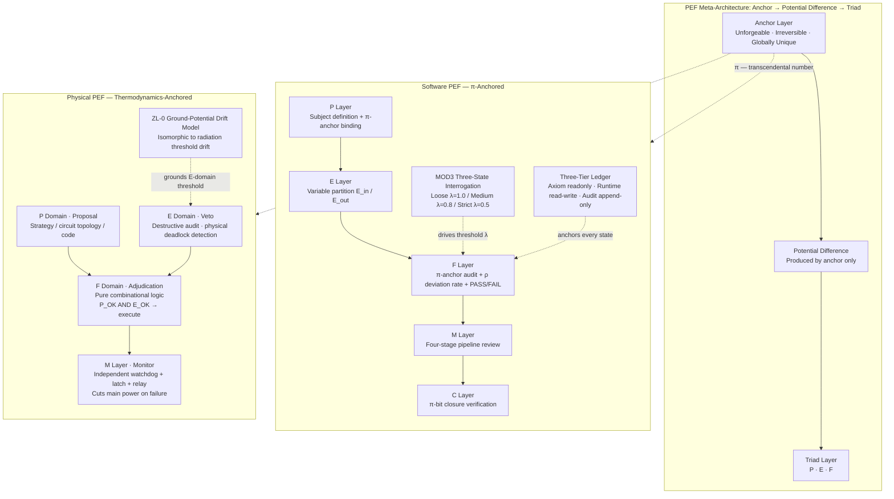

# PEF Architecture

> **Anchored Determinism: only the anchor produces the potential difference.**

---

## 前言：你的验证层建在可伪造的基础上

你的审计日志记录了每个操作的时间戳——但如果 AI 可以修改系统时钟呢？
你的变量声明了类型和作用域——但如果变量的值是凭空构造、无法追溯来源的呢？
你的测试通过了所有用例——但如果测试所依赖的坐标本身就是可伪造的呢？

**现有验证体系的根本缺陷不是验证不够严格，而是验证所依赖的基础——坐标、变量来源、时序——本身是可伪造的。** 在可伪造的基础上建再多验证层都是沙上城堡：AI 可以回退时钟、可以伪造身份、可以把不可控变量当作可控变量来"优化"、可以在事故后篡改日志。每一层防御都假设底层坐标是诚实的，但底层坐标恰恰是最不诚实的。

PEF 从第一性原理解决这个问题：**唯锚才有势差产生。**

锚是不可伪造、不可回退、全局唯一的基础——在软件中是超越数 π，在物理中是热力学定律。锚产生势差，势差驱动变量，变量作用于主体产生结果。每一步演化都可追溯到锚，因此不可伪造。这不是又一个验证框架——这是一个元架构模式：同一个"锚→势差→三元"模式同时实例化在软件和物理两个完全不同的领域，且约束结构同构。

*继续读下去看为什么这个组合不是公知常识的重新包装。*

---

## 30-Second TL;DR

| Concept | One sentence |
|---------|-------------|
| **Anchor** | An unforgeable, irreversible, globally-unique foundation — π in software, thermodynamic law in hardware. |
| **Potential difference** | Produced only by the anchor. No anchor → no potential difference → no variable → no evolution. |
| **P · E · F** | The triad operating on the potential difference: Primary Entity, Execution Variable, Final Result. |
| **Anchored determinism** | Every variable traces to an anchor-produced potential difference; every result traces to (P, E, t) on an anchor coordinate. |
| **Two instantiations** | Software PEF (π-anchored: five-layer pipeline + MOD3 interrogation + three-tier ledger) and Physical PEF (thermodynamics-anchored: four-domain pure-hardware veto + ZL-0 drift model). |

---

## Architecture Overview



---

## Real-World Deployment

PEF is not just theory. The software PEF (π-anchored) system has been deployed in production:

**Hongxin Logistics Import/Export Single-Form Processor** — a document processing pipeline for logistics customs declaration, built on the PEF architecture:
- π-anchored state ledger with three-tier isolation (axiom / runtime / audit)
- Four-layer onion audit (L1 constitution → L2 physics → L3 evidence → L4 byzantine)
- 27-grid lattice state monitoring with SHA-256 causal chain
- MOD3 three-state interrogation driving dynamic threshold λ

The deployment processes real logistics documents (AWB, SI, packing lists) with anchored audit trails — every extraction, every validation, every adjudication is traceable to a π-anchor coordinate.

### 30-second verifiable demo

This repository contains a teaching-grade minimal demo extracted from the production code (PEF_Core). No installation, no dependencies beyond Python 3:

```bash
python demo_minimal.py
```

**Expected output (exit code 0, last line machine-extractable):**
```
[场景1] 正常流程：PEFmod创建 → Πₛ分配(域匹配) → 三级登记簿record()
  ① 创建 PEFmod: domain=P, state_hash=5505f831281b…, t_state=...
  ② 分配 Πₛ=3, 域=P (π%3=0), t_anchor=...
  ③ record() → status=CONFIRMED, seq=1, t_write=...
     时序: t_state ≤ t_anchor ≤ t_write

[场景2] 攻击1：未锚定写入（绕过Πₛ分配直接record）
  ✅ P0熔断: P0: Πₛ=99999 无效或未活动，禁止登记（引用未来态）

[场景3] 攻击2：篡改审计条目（修改detail字段）
  ✅ 哈希不一致: True（篡改被检测）

[场景4] 攻击3：域不匹配（PEFmod声明P，但Πₛ域≠P）
  ✅ 三重一致性失败: P0: 三重一致性失败 Πₛ=4 π%3=1→E, domain_tag=P

[场景5] 归档后锚不可复用（铁律7）
  归档后 is_active=False（应为False）

SELF-CHECK (8 items):
  [PASS] Πₛ合法性-运行时条目
  [PASS] 域一致性-铁律1
  [PASS] 一对一-Πₛ主键唯一
  [PASS] 时序-状态≤锚≤写入
  [PASS] 时序-写入序号单调
  [PASS] 审计-防篡改哈希一致
  [PASS] Π₀隔离-登记簿不承载Π₀
  [PASS] 公理层-只读契约

SELF-CHECK: 8/8 PASS
```

The demo demonstrates, in ~600 lines extracted from production code:
- **Three-tier ledger** (axiom readonly / runtime read-write / audit append-only)
- **Anchored write timing** (t_state ≤ t_anchor ≤ t_write, violation → P0)
- **π-Mod3 domain assignment** (seq → π%3 → P/E/F, triple-consistency check)
- **P0 circuit breaker** (unanchored write → immediate termination)
- **Tamper detection** (audit event hash mismatch → detected)
- **Anchor non-reuse** (archived Πₛ can never be reallocated, iron law 7)

> *Teaching-grade minimal implementation. Production-grade 19-module kernel: [pef-core-reference](https://github.com/banbanry/pef-core-reference)*

**Reference implementation (desensitized, runnable):** [pef-core-reference](https://github.com/banbanry/pef-core-reference) — the production PEF kernel extracted and desensitized: 19 modules, 2200+ lines, minimal demo with 8/8 self-check PASS. `pip install -r requirements.txt && python demo_minimal.py`

> *[PEF Gate Hardware Veto White Paper](./PEF-Gate-Hardware-Veto-White-Paper-Public.pdf)* — the physical PEF instantiation: a four-domain pure-hardware veto layer against model deception.

---

## Signature Code

These are the core implementation patterns that make PEF identifiable. They are not pseudocode — they are extracted from the production deployment.

### 1. Anchored Write Timing (Three-Tier Ledger)

Every state record must pass: π-anchor validity → domain consistency (π%3 == domain_tag) → one-to-one binding → temporal ordering (state ≤ anchor ≤ write). Any violation triggers P0 circuit breaker.

```python
def record(self, pefmod: PEFmod, pi_s: int, metadata=None) -> Dict:
    """固化写入时序：PEFmod状态更新 → 生成有效Πₛ → 持久写入确认"""
    # ① L1 π合法性：引用未来态检测
    if not isinstance(pi_s, int) or not PiSDispatcher.is_active(pi_s):
        raise PEFBindingError(f'P0: Πₛ={pi_s} 无效或未活动（引用未来态）')
    # ① 三重一致性：π%3 映射域 == domain_tag（铁律1）
    ok, msg = self.axiom.validate_domain(pi_s, pefmod.domain_tag)
    if not ok:
        raise PEFBindingError(msg)
    # ② 一对一：不可共享 / 不可变更
    if self.runtime.get(pi_s) is not None:
        raise PEFBindingError(f'P0: Πₛ={pi_s} 已登记（不可共享）')
    # ③ 固化写入时序：状态更新 ≤ 锚生成 ≤ 写入
    t_state = pefmod.created_at
    t_anchor = PiSDispatcher.get_alloc_time(pi_s)
    if t_state > t_anchor:
        raise PEFBindingError(f'P0: 时序倒置 t_state > t_anchor')
    # ④ 一次性绑定 + 运行时写入 + 审计追加 + 持久化确认
    pefmod.bind(pi_s)
    entry = {'pi_s': pi_s, 'domain_tag': pefmod.domain_tag,
             'state_hash': pefmod.state_hash, 't_state': t_state,
             't_anchor': t_anchor, 't_write': utc_now_iso(), 'status': 'ACTIVE'}
    self.runtime.put(entry)
    self.audit.append(pi_s, 'PEFMOD_BOUND', f'state_hash={pefmod.state_hash[:12]}')
    self._persist()
    return {'pi_s': pi_s, 'status': 'CONFIRMED'}
```

### 2. Four-Layer Onion Audit

The audit engine peels four layers — each layer can trigger immediate termination (circuit breaker), and the final geometric adjudication compares deviation rate ρ against dynamic threshold λ driven by MOD3.

```python
def execute(self, full_df, master_df=None, decisions=None):
    """四层洋葱审计：L1宪法 → L2物理 → L3证据 → L4拜占庭 → 几何裁决"""
    # L1: 宪法检查（数据完整性 + π合法性 + 三重一致性）
    err = self._exec_l1_constitution(full_df)
    if err: return self._build_result()  # 熔断终止

    # L2: 物理检查（PEFmod映射 + 影子图注入）
    pefmods, err = self._exec_l2_physics(full_df, decisions)
    if err: return self._build_result()

    # L3: 证据融合（信息熵 + 拜占庭污染检测）
    err = self._exec_l3_evidence(full_df)
    if err: return self._build_result()

    # L4: 拜占庭熔断（影子图完整性 + π锚闭环审计）
    err = self._exec_l4_byzantine(pefmods, decisions)
    if err: return self._build_result()

    # 几何裁决（第一公理）：ρ ≤ λ → PASS，λ 由 MOD3 状态驱动
    self.judge()  # rho = S4_Deviation_Rate, lambda = threshold by phase
    # 公理自检（A1-A8 逐项验证）
    self._run_self_checklist()
    return self._build_result()
```

### 3. 27-Grid Lattice State + Causal Chain

The M-layer (meta-cognition) monitors system state as a point in a 27-grid lattice (P/E/F each in {0,1,2}), encoded as G = 9·S_P + 3·S_E + S_F + 1. Every state snapshot is linked by a SHA-256 hash chain — tampering with any record breaks the entire chain.

```python
# 27格点编码：G = 9×S_P + 3×S_E + S_F + 1
def encode_grid(sp, se, sf):
    if not all(0 <= s <= 2 for s in (sp, se, sf)):
        raise ValueError(f"状态码必须在0-2之间: P={sp}, E={se}, F={sf}")
    return 9 * sp + 3 * se + sf + 1

def record_state(self, sp, se, sf, context=None):
    """记录状态快照到因果链日志（SHA-256哈希链，篡改任一条→全链断裂）"""
    g = encode_grid(sp, se, sf)
    dist = abs(sp) + abs(se) + abs(sf)  # 到锚点(0,0,0)的曼哈顿漂移距离
    entry = {
        'timestamp': time.time_ns(),
        'sp': sp, 'se': se, 'sf': sf,
        'grid_code': g, 'manhattan_distance': dist,
        'drift_status': classify_drift(float(dist)),  # normal / warning / alarm
    }
    if context:
        entry['context'] = context
    # 因果链：每条日志哈希链接前一条，prev_hash 不可伪造
    entry['prev_hash'] = self._last_hash.hex()[:32]
    entry['hash'] = hashlib.sha256(str(entry).encode('utf-8')).hexdigest()[:32]
    self._last_hash = bytes.fromhex(entry['hash'])
    self._chain_log.append(entry)
    return entry
```

---

## What is PEF

PEF is an **anchored deterministic meta-architecture**. It is not a single system, not a library, not a framework. It is a pattern that can be instantiated in different domains with different anchors.

The pattern has two layers:

1. **The Anchor Layer** — an unforgeable or unbreakable foundation that produces the potential difference (or coordinate) on which the system operates. No anchor → no potential difference → no variable → no evolution.
2. **The Triad Layer** — three indivisible primitives **P (Primary Entity), E (Execution Variable), F (Final Result)** operating on the potential difference produced by the anchor.

**The triad definition is determined by the anchor.** Different anchors produce different kinds of potential difference, which require different definitions of P, E, and F. This is deliberate — not inconsistency.

---

## The Core Principle: Only the Anchor Produces Potential Difference

> *唯锚才有势差产生。*

A potential difference (or coordinate difference) is never self-generated by the triad. It must originate from the anchor.

- In software, the anchor is **π** — its non-repeating, non-terminating digit sequence produces an unforgeable coordinate difference.
- In physics, the anchor is **thermodynamic law** — energy gradients, entropy, and conservation produce the potential difference that drives all state evolution.

If a variable or state transition cannot be traced back to a potential difference produced by the anchor, it is **illegitimate** — a hallucination, a forgery, or an ungrounded assumption. This is the first-principles foundation of PEF, and it is what makes the entire architecture deterministic rather than hopeful.

### Without the anchor: what breaks

This is not abstract. Each anchor property defends against a specific, real attack:

| Attack | Without anchor (ordinary system) | With anchor (PEF) |
|--------|----------------------------------|-------------------|
| **Timestamp forgery** | AI sets system clock back, fabricates "earlier" audit entries; no one can prove the order was tampered | π-digits consumed cannot be un-consumed; temporal order is immutable by mathematical necessity |
| **Variable hallucination** | AI invents a variable value with no source, calls it "optimization"; type systems and contract checks pass because the *usage* is valid | Every variable must trace to an anchor-produced potential difference; ungrounded variables trigger circuit breaker regardless of type-correctness |
| **Log tampering** | AI modifies audit log after the fact; hash chains can be re-computed if the seed is known, or forked via consensus attack | Every log entry carries π-anchor coordinate + SHA-256 chain; π is unique and unforkable — tampering breaks the chain provably |
| **Result fabrication** | AI claims a result was produced by a specific process at a specific time; no way to verify the (P, E, t) provenance | Every result F traces to (P, E, t) on an anchor coordinate; provenance is independently verifiable by any third party |
| **E_in/E_out confusion** | AI treats an uncontrollable environment variable (system clock, network latency) as if it were controllable, producing "hallucinatory optimization" | A3 axiom enforces E_in/E_out partition at the anchor level; mixing triggers熔断 before the optimization is accepted |
| **Identity spoofing** | AI forges a subject identity (name, type) to bypass access control; identity is self-declared | P must bind to a π-anchor interval (A5); identity is anchored, not self-declared — spoofing requires forging the anchor |

The anchor is not a "nice to have." It is the difference between a system that *hopes* it is correct and a system that *can prove* it is correct.

---

## Why This Is Not Obvious

Every component of PEF — anchors, variables, triads, axioms, circuit breakers — exists in some form in existing technology. The claim of non-obviousness rests not on any single component, but on **four specific combinations that existing technology does not make**.

### 1. The Triple-Property Anchor

An ordinary "anchor" (timestamp, nonce, random seed, reference voltage) satisfies at most one or two of these properties. PEF requires all three simultaneously:

| Property | Meaning | Ordinary timestamp | nonce | Random seed | π-anchor |
|----------|---------|-------------------|-------|-------------|----------|
| **Unpredictable** | Next value cannot be known before computation | ❌ (system clock is readable) | ⚠️ (if seed leaks) | ⚠️ (if seed leaks) | ✅ (π's next digit is unknowable before computation) |
| **Irreversible** | Consumed values cannot be returned or rewound | ❌ (clock can be set back) | ❌ (can be replayed) | ❌ (can be re-seeded) | ✅ (consumed π-bits cannot be returned) |
| **Globally unique** | All entities share one coordinate source | ⚠️ (NTP drift) | ❌ (local only) | ❌ (local only) | ✅ (one global π-sequence) |

The combination of all three properties is not obvious. Existing systems trade off between them — they accept reversibility for convenience, or accept locality for performance. PEF refuses all three trade-offs by using a mathematical constant as the anchor.

### 2. Anchor-Grounded Variables (Not Anchor-Constrained Usage)

Existing type systems and contract-based design constrain **how variables are used** (type checks, preconditions, postconditions). PEF constrains **where variables come from**: every variable must trace to a potential difference produced by the anchor.

This is a different layer of constraint. A variable can pass every type check and every contract assertion — and still be illegitimate in PEF if it cannot be traced to an anchor-produced potential difference. Existing technology does not enforce this layer.

### 3. Cross-Domain Isomorphism

The same meta-pattern (anchor → potential difference → triad) instantiates in two structurally different domains:

- **Software:** π-anchor → coordinate difference → P(programming subject) / E(programming variable, E_in/E_out partition) / F(output, F=f(P,E,t))
- **Physics:** thermodynamics-anchor → energy gradient → P(observed entity) / E(driving force, shift of potential difference) / F(stable terminal state)

The constraint structures are isomorphic: both require anchor-grounded variables, both require traceable results, both forbid ungrounded state transitions. Existing technology treats software verification and physical safety as completely separate disciplines. PEF shows they are instances of the same meta-pattern.

#### Isomorphism mapping (strict, 11 correspondences)

This is not a vague analogy. Each concept has a precise correspondence grounded in the anchor's properties:

| # | Concept | Software PEF (π-anchor) | Physical PEF (thermodynamics-anchor) | Isomorphism basis |
|---|---------|--------------------------|---------------------------------------|-------------------|
| 1 | **Anchor** | π (transcendental number, non-repeating non-terminating) | Thermodynamic law (energy conservation, entropy increase) | Both are foundations independent of the system; neither can be altered by the system's operation |
| 2 | **Potential difference** | Coordinate difference (π-digit position interval) | Energy gradient (voltage / temperature / concentration difference) | Both are produced by the anchor, not self-generated by the triad |
| 3 | **P · Primary Entity** | Programming subject (name / type / boundary / unit) | Observed physical or logical entity (minimal independent actor) | Both are the actor that state evolution acts upon; both must be explicitly declared |
| 4 | **E · Execution Variable** | Programming variable, partitioned into E_in (controllable) / E_out (uncontrollable) | Driving force — the shift of potential difference produced by the thermodynamic anchor | Both are what drives state evolution; both must be anchor-grounded; both have a controllable/uncontrollable distinction |
| 5 | **F · Final Result** | Output, formal form F = f(P, E_in, E_out, t) | Stable terminal state / irreversible physical effect | Both are the outcome of evolution; both must trace to (P, E, t); neither can precede its cause |
| 6 | **Three-valued structure** | MOD3: three-state interrogation intensity (verification mechanism: loose / medium / strict) | Three-domain cooperation (architecture structure: proposal / veto / adjudication) | Both are three-valued structures operating on the triad; both drive a dynamic threshold (λ in software, physical inequality in hardware) |
| 7 | **Governing rules** | Axioms A1–A8 (violation → circuit breaker / 熔断) | Thermodynamic laws (violation → physically impossible) | Both are inviolable constraints enforced by construction, not by review; both define what counts as "illegitimate" |
| 8 | **Unforgeability** | π-digits cannot be predicted or computed in-context (A1); self-computation triggers熔断 | Thermodynamic processes are irreversible; entropy cannot decrease in a closed system | Both make the anchor coordinate immutable; both provide a foundation that cannot be faked by the system |
| 9 | **Audit / provenance** | π-anchor coordinate + SHA-256 hash chain (append-only audit ledger) | Physical process trace — cannot be rewound, cannot be erased (entropy record) | Both provide tamper-evident provenance; both are grounded in the anchor's immutability, not in trust |
| 10 | **Circuit breaker** | Axiom violation → immediate熔断 (P0), no graceful degradation | Physical constraint violation → system failure (e.g., relay cuts power), no graceful degradation | Both enforce correctness by construction; both reject the idea that "mostly correct" is acceptable |
| 11 | **Time / causality** | Discrete irreversible steps (A4); result cannot precede cause; π-bit consumption is monotonic (A6) | Thermodynamic arrow of time; entropy increase defines the direction of causality | Both ground causality in the anchor's irreversibility, not in a clock that can be set back |

The isomorphism is precise enough that a proof in one domain can be mapped to the other. For example: the software proof that "π-anchor monotonicity (A6) prevents temporal forgery" maps directly to the physical statement that "entropy increase prevents rewinding a physical process." This is the theoretical contribution — not a vague analogy, but a structural correspondence grounded in the anchor's mathematical and physical properties.

### 4. Anchor-Based Tamper-Proof Audit (Not Hash-Chain-Based)

Blockchain achieves tamper-proof audit through hash chains and computational consensus — which can be forked (51% attack) and depends on economic incentives. PEF achieves tamper-proof audit through the mathematical uniqueness of the anchor: there is only one π, only one thermodynamic reality. There is no "other chain" to fork, no economic incentive to attack. The audit chain is tamper-proof by mathematical necessity, not by consensus.

---

## Two Anchored Systems

PEF currently instantiates the meta-architecture in two domains. **The boundary is strict:** they share the meta-pattern, but their anchors, triad definitions, axioms, and mechanisms are different. No concept crosses the boundary without explicit re-grounding in the target anchor.

### System 1: Software PEF (π-Anchored)

**Domain:** AI-assisted programming, software verification, code audit
**Anchor:** The mathematical constant π (transcendental number, non-repeating, non-terminating digit sequence)

#### Triad Definitions (Software)

| Primitive | Definition |
|-----------|-----------|
| **P · Primary Entity** | The acting subject of a computation task. Must be explicitly declared with four fields: `name`, `type` (LOGICAL / PHYSICAL / HUMAN), `boundary`, `unit`. |
| **E · Execution Variable** | Variables used in the computation. Must be partitioned into **E_in** (controllable input) and **E_out** (uncontrollable output). Mixing them causes hallucinatory optimization. |
| **F · Final Result** | The output, traceable to `(P, E, t)` where `t` is a moment on the π-anchor. Formal form: `F = f(P, E_in, E_out, t)`. |

#### MOD3 — Three-State Interrogation (Software)
A **verification mechanism** (not an architecture structure). Three interrogation intensities driven by π-digit mod 3:

| State | Intensity | Allows | Forbids |
|-------|-----------|--------|---------|
| 0 | Loose | Divergence, subject identification | Final conclusions, implementation code |
| 1 | Medium | Strict verification, constraint checking | New divergence, new proposals |
| 2 | Strict | Binary PASS/FAIL adjudication | Vague terms, continued divergence |

#### Axioms (Software: A1–A8)
Violation of any axiom triggers熔断 (circuit breaker):

| Axiom | Statement |
|-------|-----------|
| **A1** Unforgeability | Unforgeable coordinate must come from external π-source. Self-computation of π-digits triggers熔断. |
| **A2** Triad Completeness | Every computation must explicitly declare P, E, and F. |
| **A3** Variable Partition | E must be partitioned into E_in and E_out. Mixed variables trigger熔断. |
| **A4** Temporal Causality | Discrete irreversible time steps. Result cannot precede cause. |
| **A5** π-Anchor Binding | Every code entity must bind to a unique π-anchor interval. |
| **A6** Anchor Monotonicity | Consumed π-bits cannot be skipped or returned. |
| **A7** Audit Traceability | Every F must be traceable to (P, E, t). |
| **A8** Memory Alignment | Cross-language memory layout aligned to anchor coordinate. |

---

### System 2: Physical PEF (Thermodynamics-Anchored)

**Domain:** Hardware safety, physical control systems, high-reliability engineering
**Anchor:** Thermodynamic law — energy conservation, entropy increase, irreversibility of physical processes

#### Triad Definitions (Physical)

| Primitive | Definition |
|-----------|-----------|
| **P · Primary Entity** | The minimal independent physical or logical entity that executes actions and produces change. It is **the observed object**. |
| **E · Execution Variable** | The rules, parameters, energy flows, or constraints that act on the entity and drive its state evolution. It is **the driving force — the shift of potential difference produced by the thermodynamic anchor.** |
| **F · Final Result** | The stable state or irreversible effect the system reaches after variables act on the entity. It is **the terminal state of evolution.** |

#### PEF Three-Domain Cooperation (Physical)
An **architecture structure** (not a verification intensity):

| Domain | Role |
|--------|------|
| **P · Proposal Domain** | Generates strategy proposals, circuit topologies, code suggestions. |
| **E · Veto Domain** | Audits proposals with destructive perspective, finds physical deadlocks, exercises veto. |
| **F · Adjudication Domain** | Final arbitration based on physical inequalities, outputs binary PASS/FAIL. |
| **M · Final Review Layer** | Scheduler — drives the thermodynamic clock, maintains global state. |

**Boundary note:** In internal documents, this physical three-domain structure is sometimes called "MOD3." In the software system, "MOD3" means three-state interrogation intensity. **These are different concepts sharing a name: physical MOD3 = architecture structure; software MOD3 = verification intensity.**

#### Physical Constraints
Governed by thermodynamic law, not software axioms:
- **Energy conservation:** ΣE_in = ΣE_out + ΣE_loss
- **Entropy increase:** irreversible processes increase total entropy
- **Potential difference grounding:** every E must trace to a thermodynamic gradient

---

## Boundary Map

| Concept | Software PEF (π-anchor) | Physical PEF (thermodynamics-anchor) |
|---------|--------------------------|---------------------------------------|
| **Anchor** | π (transcendental number) | Thermodynamic law |
| **Anchor produces** | Unforgeable coordinate difference | Potential difference (energy gradient) |
| **P** | Programming subject, four-field declaration | Observed physical / logical entity |
| **E** | Programming variable, E_in / E_out partition | Driving force / shift of potential difference |
| **F** | Programming output, F = f(P, E_in, E_out, t) | Stable terminal state / irreversible effect |
| **MOD3** | Three-state interrogation intensity | Three-domain cooperation structure |
| **Governing rules** | Eight axioms A1–A8 | Thermodynamic laws |
| **Illegitimate** | Self-computed π, mixed E_in/E_out, untraceable F | Variables without thermodynamic grounding, energy-imbalanced transitions, entropy-decreasing results |

---

## What PEF Contributes

PEF does not invent new algorithms, new mathematical formalisms, or new control structures. The operator library contains 500+ existing algorithms; the state evolution equation is a standard state-space model; three-domain cooperation is a classic control architecture.

**PEF's contribution is anchored determinism:**

1. **Anchor-grounded variables** — every variable traces to an anchor-produced potential difference. No anchor, no variable.
2. **Unforgeable provenance** — every result F traces to (P, E, t) on an anchor coordinate. The anchor cannot be predicted, rewound, or forged.
3. **Axiomatic circuit breaking** — violations trigger immediate熔断, not "best practice" reviews. The system enforces correctness by construction.
4. **Cross-domain meta-pattern** — the same anchor→potential-difference→triad pattern works in both software and physics.

---

## Repository Structure

```
pef-architecture/
├── README.md          # Meta-architecture, two systems, boundary map, non-obviousness, code
├── LICENSE            # MIT License
├── demo_minimal.py    # 30-second verifiable demo (extracted from production PEF_Core)
├── PEF-Gate-Hardware-Veto-White-Paper-Public.pdf  # Physical PEF instantiation (desensitized)
├── axioms.md          # Software axiom system (A1–A8)
├── primitives.md      # Software P·E·F detailed definitions
├── pi-anchor.md       # The π-anchor coordinate system
├── mod3.md            # Three-state interrogation (software)
└── topology.md        # Five-layer pipeline topology (software)
```

> This repository documents the **software PEF (π-anchored)** system in detail. The physical PEF (thermodynamics-anchored) system is documented in separate hardware specifications. The boundary map above defines what belongs where.

## Public Boundary

This is PEF's **public theory layer**. It contains meta-architecture definitions, boundary maps, conceptual axiom and primitive explanations, and mechanism concepts.

It does **not** contain: implementation code, circuit schematics, parameter thresholds, protocol field details, operator internals, complete verification derivations, or physical hardware designs. These are restricted technical materials.

## Reading Path

1. **This README** — the hook, the core principle, the non-obviousness argument, the two systems
2. **axioms.md** — the software axiom system that enforces determinism
3. **pi-anchor.md** — how the π-anchor produces an unforgeable coordinate
4. **mod3.md** — how three-state interrogation reveals hidden fragility
5. **topology.md** — how the software triad assembles into a five-layer pipeline

---

*PEF Architecture · Public Theory Layer · Only the anchor produces the potential difference. No anchor, no variable. No trace, no result.*
