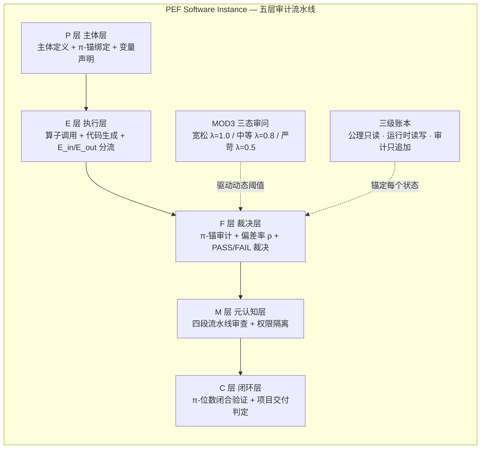
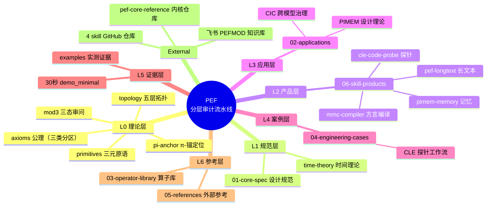

# PEF Architecture


> **PEF 是一套「无状态 LLM 工蜂 + 确定性 M 层内核 + 哈希链日志 + 分层门控矫正」的长文本/多 Agent 幻觉治理审计流水线。**
> **π-锚是这套架构采用的一套时序分片标记方案**——仅用于日志标记、会话分片与防向量坍缩；架构主体可以替换该标记组件而不失效。

---

## 30-Second TL;DR

| 概念 | 一句话 |
|------|--------|
| **问题** | LLM 在长文本/多 Agent 场景下产生实体漂移、身份幻觉、不可追溯输出——"模型说自己是对的，但无法证明输入真实性" |
| **PEF 解法** | 让 LLM 只做"识别与提取"（无状态工蜂），把"判定与裁决"交给确定性内核（M 层），全部过程哈希链留痕、分层门控矫正 |
| **P · E · F** | 三个不可再分的原语：P（Primary Entity，主体）/ E（Execution Variable，执行变量，E_in 可控 / E_out 不可控分流）/ F（Final Result，结果，F=f(P,E,t) 可追溯） |
| **π-锚** | 时序/身份标记组件：提供无限展开、可复现的坐标序列，防大模型向量坍缩；**不承担密码学安全角色** |
| **差异化** | 不提高"提取准确率"——提高的是**检测坏提取的能力**与**所有提取的可审计性** |

---

## 架构总览：五层流水线



**数据流**：P 层（主体定义 + π 表 + 锚分配）→ E 层（算子 + 生成 + 分流）→ F 层（π 锚审计 + ρ 计算 + PASS/FAIL）→ M 层（流水线审查拦截）→ C 层（闭合环验证 + 交付判定）。层间双闸门拦截。

**控制流**：MOD3 状态机驱动动态阈值 λ，λ 决定 F 层裁决严格度；影子图协议保障层间逻辑链完整性；雁阵调度协议保障多节点协作同步。

---

## 核心机制

### 1. 无状态工蜂 + 确定性内核

LLM 工蜂**绝对无状态**，只做实体识别与不等式结构提取（原文坐标锚定）；判定逻辑全部落在 M 层确定性求解（CRITIC 不等式 + SQLite + 哈希链）。**可判定的事不交给概率模型**——这是架构的第一原则。

### 2. MOD3 三态审问（多强度验证）

同一系统、同一偏差率，在不同审问强度下得出不同判决，揭示隐藏脆弱性：

| 状态 | λ | 审问强度 | 允许 | 禁止 |
|---|---|---|---|---|
| 0 | 1.0 | 宽松（正常运行） | 主体识别、变量拆解、方案发散 | 下最终结论、生成实现代码 |
| 1 | 0.8 | 中等（严格校验） | 严格校验、不等式构建、约束检查 | 发散、生成新方案 |
| 2 | 0.5 | 严苛（逃生舱） | 给出明确的 PASS/FAIL 判决 | 模糊词汇、继续发散 |

### 3. 三级账本 + 哈希链审计

| 层级 | 权限 | 用途 |
|---|---|---|
| 公理层 | 只读 | 公理定义，不可修改 |
| 运行时层 | 读写 | 当前状态 |
| 审计层 | 只追加 | 全部历史事件，SHA-256 哈希链，篡改任一条 → 全链断裂 |

### 4. A/B 对比：PEF 的价值定位

| | A 组（裸 LLM） | B 组（PEF 流水线） |
|---|---|---|
| 提取后 | 希望自己是对的（无法验证输入真实性） | **能证明自己是对的**（每次提取有 π 锚坐标 + 异常检测 + 哈希链审计） |
| 异常时 | 静默出错 | CRITICAL 异常立即熔断，留痕 |
| 审计 | 无 | 全量可追溯 |

**PEF 不提高提取准确率——它提高"检测坏提取的能力"和"所有提取的可审计性"。**

---

## 真实部署与可验证 Demo

**诚实边界声明**：软件 PEF 已完成内部业务场景原型验证（物流单证处理流水线：AWB / SI / 装箱单，三级账本 + 四层洋葱审计 + 27 格点状态监控）。**完整生产级部署材料属于私有业务资料，不在本开源仓库公开。**

### 30 秒可验证 Demo

本仓库包含教学级最小实现（从生产代码抽取，纯 Python 3，零依赖）：

```bash
python demo_minimal.py
```

**预期输出（退出码 0，末行机器可提取）**：`SELF-CHECK: 8/8 PASS`

Demo 演示：三级账本 / 锚定写入时序（t_state ≤ t_anchor ≤ t_write）/ π-Mod3 域分配 / P0 熔断（未锚定写入立即终止）/ 篡改检测（哈希不一致）/ 锚不可复用。

> *教学级最小实现。生产级内核（19 模块 ~3.9K 行）见独立仓库 [pef-core-reference](https://github.com/banbanry/pef-core-reference)。*

---

## Signature Code（生产抽取的签名模式）

这些是实现模式，不是伪代码——从生产部署抽取。

### 1. 锚定写入时序（三级账本）

```python
def record(self, pefmod: PEFmod, pi_s: int, metadata=None) -> Dict:
    """固化写入时序：PEFmod状态更新 → 生成有效Πₛ → 持久写入确认"""
    # ① L1 π合法性：引用未来态检测
    if not isinstance(pi_s, int) or not PiSDispatcher.is_active(pi_s):
        raise PEFBindingError(f'P0: Πₛ={pi_s} 无效或未活动（引用未来态）')
    # ① 三重一致性：π%3 映射域 == domain_tag（铁律1）
    ok, msg = self.axiom.validate_domain(pi_s, pefmod.domain_tag)
    if not ok:
        raise PEFBindingError(msg)
    # ② 一对一：不可共享 / 不可变更
    if self.runtime.get(pi_s) is not None:
        raise PEFBindingError(f'P0: Πₛ={pi_s} 已登记（不可共享）')
    # ③ 固化写入时序：状态更新 ≤ 锚生成 ≤ 写入
    t_state = pefmod.created_at
    t_anchor = PiSDispatcher.get_alloc_time(pi_s)
    if t_state > t_anchor:
        raise PEFBindingError(f'P0: 时序倒置 t_state > t_anchor')
    # ④ 一次性绑定 + 运行时写入 + 审计追加 + 持久化确认
    pefmod.bind(pi_s)
    entry = {'pi_s': pi_s, 'domain_tag': pefmod.domain_tag,
             'state_hash': pefmod.state_hash, 't_state': t_state,
             't_anchor': t_anchor, 't_write': utc_now_iso(), 'status': 'ACTIVE'}
    self.runtime.put(entry)
    self.audit.append(pi_s, 'PEFMOD_BOUND', f'state_hash={pefmod.state_hash[:12]}')
    self._persist()
    return {'pi_s': pi_s, 'status': 'CONFIRMED'}
```

### 2. 四层洋葱审计（L1 宪法 → L2 物理 → L3 证据 → L4 拜占庭 → 几何裁决）

每层可触发立即终止（熔断），最终几何裁决比较偏差率 ρ 与 MOD3 驱动的动态阈值 λ。

### 3. 27 格点状态 + SHA-256 因果链

M 层把系统状态编码为 27 格点（P/E/F ∈ {0,1,2}，G = 9·S_P + 3·S_E + S_F + 1），每条状态快照由哈希链串联——篡改任一条 → 全链断裂。

```python
def record_state(self, sp, se, sf, context=None):
    """记录状态快照到因果链日志（SHA-256哈希链，篡改任一条→全链断裂）"""
    g = encode_grid(sp, se, sf)
    dist = abs(sp) + abs(se) + abs(sf)  # 到锚点(0,0,0)的曼哈顿漂移距离
    entry = {'timestamp': time.time_ns(), 'sp': sp, 'se': se, 'sf': sf,
             'grid_code': g, 'manhattan_distance': dist,
             'drift_status': classify_drift(float(dist))}
    if context:
        entry['context'] = context
    entry['prev_hash'] = self._last_hash.hex()[:32]
    entry['hash'] = hashlib.sha256(str(entry).encode('utf-8')).hexdigest()[:32]
    self._last_hash = bytes.fromhex(entry['hash'])
    self._chain_log.append(entry)
    return entry
```

---

## 仓库边界（三类分区）

| 类别 | 内容 | 校验方式 |
|---|---|---|
| **① 工程公理** | A1 切片形态约束 / A3 变量分流 / A4 时序因果 / A5-A8 | **代码强制校验**，违反即熔断（见 `axioms.md`） |
| **② 策略约定** | π-Mod3 相位分配（可替换为步数取模） | 业务策略，不属不可动摇公理 |
| **③ 元理论思辨** | 软件↔物理同构映射、π 正规性猜想、热力学锚类比 | **仅启发，不参与代码校验** |

**公开/私有边界**：
- ✅ 本仓库公开：理论规约、公理体系、签名代码、最小 demo、Skill 实测证据
- ❌ 不上公开：**硬件设计方案（专利保护中，白皮书已移除）**、客户生产数据、参数阈值细节、完整内核实现（在独立私有/受控仓库）

---

## Knowledge Map — 知识地图（阅读总纲）



| 层 | 入口 | 内容 |
|---|---|---|
| L0 理论 | `axioms.md` `primitives.md` `pi-anchor.md` `mod3.md` `topology.md` | 第一性原理：三元原语、公理、π-锚定位 |
| L1 规范 | `01-core-spec/` | PEF 7.6 Pro 完整设计规范（V2.5 修正版） |
| **L2 产品** | `06-skill-products/` | **4 个 Skill 产品：功能/理论/代码/验证全链路** |
| L3 应用 | `02-applications/` | CIC 跨模型治理、PIMEM 基因记忆设计 |
| L4 案例 | `04-engineering-cases/` | CLE 探针工程工作流 |
| **L5 证据** | `examples/` + `demo_minimal.py` | **真实运行验证：4 Skill 实测 + 8/8 自检 demo** |
| L6 参考 | `03-operator-library/` `05-references/` | 算子库、行业分析 |
| 外部 | [pef-core-reference](https://github.com/banbanry/pef-core-reference) · [cle-code-probe](https://github.com/banbanry/cle-code-probe) · [pef-longtext](https://github.com/banbanry/pef-longtext) · [pimem-memory](https://github.com/banbanry/pimem-memory) · [mmc-compiler](https://github.com/banbanry/mmc-compiler) · 飞书知识库 | 内核代码 + 产品代码 + 私域知识库 |

> **阅读顺序建议**：先跑 `python demo_minimal.py`（30 秒感受）→ 读 L0 理论（5 分钟）→ 看 L5 证据（验证"能跑"）→ 深入 L1 规范 → 按兴趣进 L2/L3/L4。

---

## Repository Structure

```
pef-architecture/
├── README.md                              # 本文件：定位、架构、边界
├── LICENSE                                # MIT License
├── demo_minimal.py                        # 30秒可验证 demo（8/8 PASS）
│
├── axioms.md          # ① 公理体系（三类分区 + A1 切片形态约束）
├── primitives.md      # P·E·F 三元原语定义
├── pi-anchor.md       # π-锚：时序标记组件（防坍缩定位 + 诚实边界）
├── mod3.md            # MOD3 三态审问机制
├── topology.md        # 五层流水线拓扑
│
├── review/
│   └── review-response.md                 # 外部评审回应与整改记录（V2.5）
│
├── 06-skill-products/                     # ★ Skill 产品区（功能/理论/代码/验证全链路）
│   ├── README.md                          # 产品矩阵 + 链路结构
│   ├── cle-code-probe.md                  # 确定性代码探针
│   ├── pimem-memory.md                    # π-基因链记忆仓库
│   ├── pef-longtext.md                    # 长文本拜占庭污点审计
│   └── mmc-compiler.md                    # 多模型方言编译
│
├── examples/                              # ★ Skill 实测证据（可复现）
│   ├── README.md                          # 实例导航
│   ├── cle-probe/                         # 确定性代码探针（49/49 回归 + 跨函数污点）
│   ├── pimem-memory/                      # π-基因链记忆仓库（漂移比对 + 哈希验真）
│   ├── pef-longtext/                      # 长文本审计（百万字遍历 + 拜占庭污点）
│   └── mmc-compiler/                      # 多模型方言编译（5 模型真实 API 测试）
│
├── 01-core-spec/                          # 完整设计规范（深读）
│   └── pef-7.6-pro-design-spec.md        # PEF 7.6 Pro 完整设计规范（V2.5 修正版）
│
├── 02-applications/                       # π-锚应用扩展（CIC / PIMEM）
├── 03-operator-library/                   # PEF 三元算子库（核心 + 800 扩展）
├── 04-engineering-cases/                  # 工程案例（CLE 探针工作流）
└── 05-references/                         # 外部参考与行业分析
```

---

## Reading Path

### 5-Minute Entry
1. **本 README** — 定位与架构
2. **primitives.md** — P·E·F 三元定义
3. **axioms.md** — 公理体系（工程公理 / 策略约定 / 思辨三类分区）
4. **pi-anchor.md** — π-锚的真实定位（防坍缩，非密码学）

### 30-Minute Deep Dive
5. **01-core-spec/pef-7.6-pro-design-spec.md** — 完整设计规范
6. **examples/** — 4 个 Skill 的真实运行验证（推荐先看，这是"能跑的证明"）
7. `python demo_minimal.py` — 30 秒自检

### Skill 产品（L2）
8. **06-skill-products/** — 4 个 Skill 的功能/理论映射/代码仓库/验证证据全链路：
   - [cle-code-probe](06-skill-products/cle-code-probe.md) · [pimem-memory](06-skill-products/pimem-memory.md) · [pef-longtext](06-skill-products/pef-longtext.md) · [mmc-compiler](06-skill-products/mmc-compiler.md)

### 面对评审
8. **review/review-response.md** — 8 项属实指控整改 + 3 项误读澄清

### Explore by Interest
- **Skill 实测证据** → `examples/`（探针 / 记忆 / 长文本 / 多模型编译）
- **完整内核** → [pef-core-reference](https://github.com/banbanry/pef-core-reference)（19 模块 ~3.9K 行，A/B evaluation）
- **算子库** → `03-operator-library/`
- **应用扩展** → `02-applications/`（CIC 跨模型治理 / PIMEM 基因记忆）

---

## License & Attribution

MIT License · © 2026 沈鹭 (banbanry) · 厦门恒元架构科技有限公司

---

*PEF Architecture · 分层 LLM 幻觉治理审计流水线。不提高提取准确率，提高检测坏提取的能力与全部提取的可审计性。*
