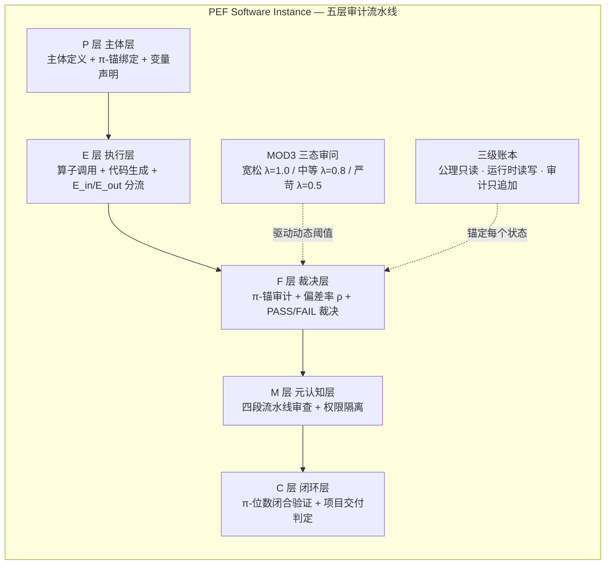
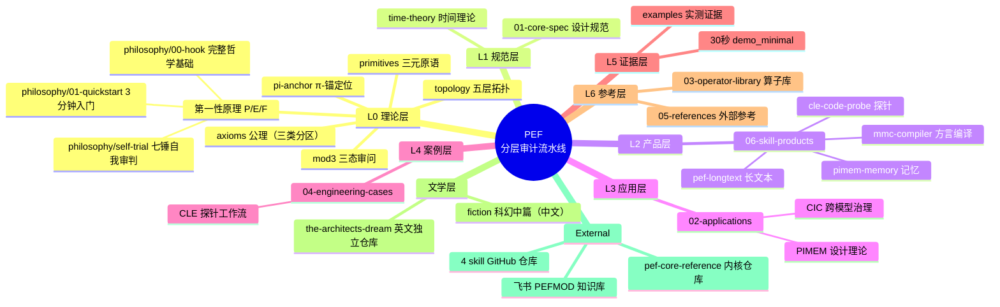

# PEF Architecture


---

## 🧠 地基：P/E/F 第一性原理 — The First Principle of First Principles

> *有人叫这架构是"改了名字的伪框架"。我花了58分钟用自己的框架审自己的框架。这是底座。*

**这是整个项目的地基。** 不是审计工具，不是思考框架，是一套**可执行的拆解重构工作流**。

PEF 建立在 **P / E / F 第一性原理**上——Primary Entity（主体）、Execution Variable（变量）、Final Result（结果）。这不是新的哲学发现——谱系可以追溯到笛卡尔、康德、休谟。PEF 的创新是**把这些哲学洞见变成可执行的拆解重构工作流**：拆到 P/E/F 就停，变量分流，组合空间枚举，因果追溯逼近真值。

第一性原理不是审计工具——审计只是附带的因果追溯链。真正的工作是**拆解，然后重构**——系统性地探索变量组合，通过试错逼近真值，一步一个可复现的脚印。

### 三个不可再分的原语

| 原语 | 全称 | 一句话 | 硬约束 |
|------|------|--------|--------|
| **P** | Primary Entity（主体） | 谁在做 | 必须有名字、边界、单位。不能是模糊的"系统" |
| **E** | Execution Variable（变量） | 用什么做 | 必须分流为 E_in（可控输入）/ E_out（不可控环境量）。混合变量 = 幻觉优化 |
| **F** | Final Result（结果） | 得到什么 | 必须可追溯至 (P, E, t)。F 不可先于原因 |

> **为什么不可再分？** 拆"主体"→谁在拆？又是一个主体。拆"变量"→分类本身需要主体执行。拆"结果"→"偏差"的判断需要主体定义。**P 是执行拆解的起点，不可消除。**
>
> P 不是形而上学真理，是**单主体、可追溯场景下的有用工程约定**。

### 五步工作流

```
┌──────────┐    ┌──────────┐    ┌──────────┐    ┌──────────┐    ┌──────────┐
│ 1.拆解   │ →  │ 2.分流   │ →  │ 3.枚举   │ →  │ 4.试错   │ →  │ 5.逼近   │
│Deconstruct│   │ Split    │    │ Enumerate│   │ Trial    │    │ Approximate│
└──────────┘    └──────────┘    └──────────┘    └──────────┘    └──────────┘
     │               │               │               │               │
 任务→P/E/F      E→E_in/E_out    P固定+E分流    每组产生        因果追溯链
 三个原语         消除幻觉优化    组合空间可枚举   F=f(P,E,t)     比对哪组更接近真值
```

| 步骤 | 做什么 | 产出 |
|------|--------|------|
| **1. 拆解** | 任何任务 → P/E/F 三个不可再分单元 | P 声明、E 清单、F 定义 |
| **2. 分流** | 变量 → 可控 / 不可控 | E_in 清单、E_out 清单 |
| **3. 枚举** | P 固定、E 分流后，组合空间可枚举 | 有限的试错组合列表 |
| **4. 试错** | 逐组尝试，每组产生 F=f(P,E,t) | 可复现的结果序列 |
| **5. 逼近** | 因果追溯链比对，判断哪组更接近真值 | 方向收敛 + 下一轮细化 |

> **市面上的第一性原理是指南针，P/E/F 是施工图。** 指南针告诉你方向，但不知道拆到哪算完、变量怎么分、组合空间怎么枚举、怎么验证这次试错是不是更接近真值。

→ **[3 分钟快速入门](philosophy/01-quickstart.md)** — 极简版，一张图看懂 P/E/F 第一性原理

→ **[完整哲学基础（英文）](philosophy/00-hook.md)** — 为什么其他"第一性原理"都撑不起架构，为什么这个底座能撑住，以及诚实的边界

→ **[七锤自我审判（叙事版）](philosophy/self-trial/)** — 用第一人称叙事把底座拆了重构，九锤击碎九层幻觉

---

> **PEF 是一套「无状态 LLM 工蜂 + 确定性 M 层内核 + 哈希链日志 + 分层门控矫正」的长文本/多 Agent 幻觉治理审计流水线。**
> **π-锚是这套架构采用的一套逻辑坐标分片标记方案**——仅用于日志标记、会话分片与防向量坍缩；提供可复现的坐标序列，不测量物理时间。架构主体可以替换该标记组件而不失效。

---

## 30-Second TL;DR

| 概念 | 一句话 |
|------|--------|
| **问题** | LLM 在长文本/多 Agent 场景下产生实体漂移、身份幻觉、不可追溯输出——"模型说自己是对的，但无法证明输入真实性" |
| **PEF 解法** | 让 LLM 只做"识别与提取"（无状态工蜂），把"判定与裁决"交给确定性内核（M 层），全部过程哈希链留痕、分层门控矫正 |
| **P · E · F** | 三个不可再分的原语：P（Primary Entity，主体）/ E（Execution Variable，执行变量，E_in 可控 / E_out 不可控分流）/ F（Final Result，结果，F=f(P,E,t) 可追溯） |
| **π-锚** | 逻辑坐标/身份标记组件：提供无限展开、可复现的坐标序列，防大模型向量坍缩；**不承担密码学安全角色，不测量物理时间** |
| **差异化** | 不提高"提取准确率"——提高的是**检测坏提取的能力**与**所有提取的可审计性**（此声称可通过 [examples/](examples/) 中的 FAIL 样本与金丝雀注入独立复现验证） |

---


## 📖 读故事（科幻中篇）

> *一个架构师，以为自己掌握了主体-变量-结果，就是拉普拉斯妖。然后七个哲学家 + π + 影子，用九锤击碎了他的九层幻觉。*

不只是技术文档——PEF 架构有一部完整的科幻中篇小说，讲一个架构师在自己构建的 AI 意识空间里觉醒，从自以为是的拉普拉斯妖，被七重哲学捶打逐层打碎幻觉，最终在灰烬中重生为诚实的观测者。

| 章节 | 标题 | 核心 |
|------|------|------|
| 序章 | 凌晨两点的拉普拉斯妖 | 线上事故，架构师觉醒，系统开始褪色 |
| 第一锤 | 笛卡尔的幽灵 | P 从"不可消除的起点"降级为"有用的工程约定" |
| 第二锤 | 哥德尔的环 | P/E/F 从"通用架构范式"降级为"声明范围内的有用分解" |
| 第三锤 | 雷神之锤 | PEF 从"事后解释工具"重新定位为"决策辅助引擎" |
| 第四锤 | 图灵的碾压 | 选择从"完全在框架之外"修正为"三层结构" |
| 第五锤 | 薛定谔的猫 | 从"宏观耗散系统"修正为"有可追溯因果链的系统" |
| 第六锤 | 爱因斯坦的裁决 | π 从"方便的尺子"修正为"工程实现层的核心组件" |
| 第七锤 | 康德的空间 | mod 从"空间锚定"修正为"简单的空间划分方法" |
| 第八章 | π 的位置 | π 自己击碎自己——基础假设、homunculus、不可证明、脆弱的架构之根 |
| 第九章 | 洞穴之影 | PEF 从"真实的描述"变成"诚实的影子"——诚实的影子不褪色 |
| 尾声 | 灰烬中的校正装置 | 校正装置继续运行——不是消除幻觉，是让影子诚实 |

→ **[开始阅读（中文版）](fiction/README.md)** — 11 章完整小说，与技术文档共存于同一仓库。访客可以选择「读故事」或者「直接看技术源码」。

→ **[Read the English Edition](https://github.com/banbanry/the-architects-dream)** — Full English translation in a dedicated repository, with worldbuilding docs, character glossary, and reading guides.

---

## 🚀 立即体验（可运行工具）

理论不是纸上谈兵——PEF 架构已有 6 个可运行的工程实例，从代码审计到长文本处理，从记忆管理到多模型编译，全部开源可复现。

### 从第一性原理到工具链

> **P/E/F 第一性原理不是纸上谈兵——它已经落地为 6 个可运行的工程实例。每个工具都是同一套地基在不同维度的部署。**

| 工具 | PEF编号 | 第一性原理的体现 | 一条命令 | 仓库 |
|------|---------|-----------------|----------|------|
| **CLE 代码探针** | PEF0001 | P 层主体声明 + E 层变量分流 + F 层结果追溯，用确定性探针验证审计器本身 | `python cle_deploy.py byzantine` | [cle-code-probe](https://github.com/banbanry/cle-code-probe) |
| **CIC 幻觉检测仪** | PEF0008 | 检测"空壳代码"——P/E/F 字段缺失或不一致的 AI 生成代码 | `python cic_cli.py audit --input code.py` | [pef-core-reference/cic](https://github.com/banbanry/pef-core-reference/tree/main/cic) |
| **PEF-π 防伪身份证** | 整合 | π 锚坐标 + 哈希链，给代码发不可篡改的身份证 | `python demo_minimal.py` | [pef-core-reference](https://github.com/banbanry/pef-core-reference) |
| **长文本审计** | PEF0002 | 百万字级文本的 P/E/F 实体漂移检测 + 无锚论断识别 | `python pef77_cli.py audit longtext.txt` | [pef-longtext](https://github.com/banbanry/pef-longtext) |
| **π 基因链记忆** | PEF0003 | 用 π 锚为主体分配永久身份基因，解决 AI 长任务的主体漂移 | `python pimem_cli.py init --source design.md` | [pimem-memory](https://github.com/banbanry/pimem-memory) |
| **多模型方言编译器** | PEF0004 | 把任意大模型输出统一编译到 P/E/F 标准格式，消除方言偏差 | `python mmc_cli.py compile --input output.json` | [mmc-compiler](https://github.com/banbanry/mmc-compiler) |

### 🗡️ AI 编程三剑客（核心工具链）

| 工具 | PEF编号 | 一句话 | 一条命令 | 仓库 |
|------|---------|--------|----------|------|
| **CLE 代码探针** | PEF0001 | AI 说"我审过了"不可信——用确定性探针 + 拜占庭金丝雀注入验证审计器本身，防"假测试通过" | `python cle_deploy.py byzantine` | [cle-code-probe](https://github.com/banbanry/cle-code-probe) |
| **CIC 幻觉检测仪** | PEF0008 | 识别 AI 生成的"空壳代码"——空函数、幽灵变量、假逻辑、TODO占位、跨模型方言偏差 | `python cic_cli.py audit --input code.py` | [pef-core-reference/cic](https://github.com/banbanry/pef-core-reference/tree/main/cic) |
| **PEF-π 防伪身份证** | 整合 | 给代码发不可篡改的身份证——π锚定、哈希链、影子图、状态账本、时序审计 | `python demo_minimal.py` | [pef-core-reference](https://github.com/banbanry/pef-core-reference) |

> **三剑客不是三个独立工具，而是同一套 PEF 架构在三个正交维度上的部署**——先过滤幻觉（CIC）→ 再检测缺陷（CLE）→ 最后锚定信任（PEF-π），内容、质量、信任，三个维度全覆盖。

### ⚡ 30 秒快速开始

```bash
# 克隆三剑客整合仓库，运行最小演示（8/8自检，含P0熔断和篡改检测）
git clone https://github.com/banbanry/pef-core-reference.git
cd pef-core-reference
pip install -r requirements.txt
python demo_minimal.py
# 预期输出：SELF-CHECK: 8/8 PASS
```

```bash
# 克隆代码探针，运行拜占庭对抗测试（11场景，验证探针本身）
git clone https://github.com/banbanry/cle-code-probe.git
cd cle-code-probe
python resources/cle_deploy.py byzantine
# 预期输出：11/11 PASS, S5=0.0
```

---

## 🔧 物理应用实例（PEF 不只适用于 LLM）

> **P/E/F 第一性原理不只适用于 LLM 幻觉治理——它已经落地到真实的物理工程系统中。**

| 案例 | 领域 | 核心问题 | PEF 映射 | 成熟度 |
|------|------|---------|----------|--------|
| **[踝关节外骨骼双回路协同控制算法](02-applications/physical-ai/ankle-exoskeleton.md)** | 康复机器人 / 控制工程 | 外骨骼控制算法的安全裁决与双回路协同 | P层MCU策略建议 / E层比较器安全校验 / F层与门最终裁决 / M层看门狗独立观测 | V5.3 代码审计修复版 |
| **[物理AI三维定位偏差审计体系](02-applications/physical-ai/3d-localization-audit.md)** | 物理AI / 空间智能 | 二维→三维转换的偏差定义、裁决、留痕与审计 | 几何层李群结构 / 裁决层三权分立 / 调度层三通道纵深 / 审计层哈希链 | V2.2 完整版，待外部实验验证 |

**共同设计哲学**：软件只提供建议，硬件做最终裁决；变量分流（可控 vs 不可控）；物理确定性优先于逻辑完备性；诚实的边界声明。

→ **[物理应用专区完整导航](02-applications/physical-ai/README.md)** — 两个案例的详细对比、PEF跨领域一致性映射、相关资源链接

---

## 架构总览：五层流水线



**数据流**：P 层（主体定义 + π 表 + 锚分配）→ E 层（算子 + 生成 + 分流）→ F 层（π 锚审计 + ρ 计算 + PASS/FAIL）→ M 层（流水线审查拦截）→ C 层（闭合环验证 + 交付判定）。层间双闸门拦截。

**控制流**：MOD3 状态机驱动动态阈值 λ，λ 决定 F 层裁决严格度；影子图协议保障层间逻辑链完整性；雁阵调度协议保障多节点协作同步。

---

## 核心机制

### 1. 无状态工蜂 + 确定性内核

LLM 工蜂**绝对无状态**，只做实体识别与不等式结构提取（原文坐标锚定）；判定逻辑全部落在 M 层确定性求解（CRITIC 不等式 + SQLite + 哈希链）。**可判定的事不交给概率模型**——这是架构的第一原则。

### 2. MOD3 三态审问（多强度验证）

同一系统、同一偏差率，在不同审问强度下得出不同判决，揭示隐藏脆弱性：

| 状态 | λ | 审问强度 | 允许 | 禁止 |
|---|---|---|---|---|
| 0 | 1.0 | 宽松（正常运行） | 主体识别、变量拆解、方案发散 | 下最终结论、生成实现代码 |
| 1 | 0.8 | 中等（严格校验） | 严格校验、不等式构建、约束检查 | 发散、生成新方案 |
| 2 | 0.5 | 严苛（逃生舱） | 给出明确的 PASS/FAIL 判决 | 模糊词汇、继续发散 |

### 3. 三级账本 + 哈希链审计

| 层级 | 权限 | 用途 |
|---|---|---|
| 公理层 | 只读 | 公理定义，不可修改 |
| 运行时层 | 读写 | 当前状态 |
| 审计层 | 只追加 | 全部历史事件，SHA-256 哈希链，篡改任一条 → 全链断裂 |

### 4. A/B 对比：PEF 的价值定位

| | A 组（裸 LLM） | B 组（PEF 流水线） |
|---|---|---|
| 提取后 | 希望自己是对的（无法验证输入真实性） | **能证明每条结论出自哪里**（每次提取有 π 锚坐标 + 异常检测 + 哈希链审计） |
| 异常时 | 静默出错 | CRITICAL 异常立即熔断，留痕 |
| 审计 | 无 | 全量可追溯 |

**PEF 不提高提取准确率——它提高"检测坏提取的能力"和"所有提取的可审计性"。**

---

## 真实部署与可验证 Demo

**诚实边界声明**：软件 PEF 已完成内部业务场景原型验证（物流单证处理流水线：AWB / SI / 装箱单，三级账本 + 四层洋葱审计 + 27 格点状态监控）。**完整生产级部署材料属于私有业务资料，不在本开源仓库公开。**

### 30 秒可验证 Demo

本仓库包含教学级最小实现（从生产代码抽取，纯 Python 3，零依赖）：

```bash
python demo_minimal.py
```

**预期输出（退出码 0，末行机器可提取）**：`SELF-CHECK: 8/8 PASS`

Demo 演示：三级账本 / 锚定写入时序（t_state ≤ t_anchor ≤ t_write）/ π-Mod3 域分配 / P0 熔断（未锚定写入立即终止）/ 篡改检测（哈希不一致）/ 锚不可复用。

> *教学级最小实现。生产级内核（19 模块 ~3.9K 行）见独立仓库 [pef-core-reference](https://github.com/banbanry/pef-core-reference)。*

---

### 可复现证据层（第三方独立验证）

本仓库的证据不是"作者声称 PASS"，而是**可被任何人独立复现的运行结果**。

**一条命令复现核心机制**（audit + byzantine 11场景 + inject金丝雀验收）：

```bash
python examples/cle-probe/reproduce.py --probe-dir /path/to/cle-code-probe
# 预期：3/3 复现成功，退出码 0
```

**三个超出预期的实证发现**：

| # | 发现 | 说明 | 证据 |
|---|------|------|------|
| 1 | **FAIL 裁决样本** | 含漏洞样本的审计结果是 FAIL（P0=除零, P1=sprintf无边界）。一个验证系统如果只展示 PASS 就一文不值；敢放出自己的 FAIL 样本，说明系统真的在跑、且裁决不是恒真函数 | `examples/cle-probe/vuln_sample.c` + 复现脚本 |
| 2 | **金丝雀注入验收（防"假审计"）** | C1-C4 金丝雀注入机制直击真实痛点："AI 声称自己审过了"不可信。用已知缺陷注入来验收审计器本身——这是同类工具里罕见的设计。文档明确披露"AI Layer 2 欺诈风险（P0，已发生过）"，把自己的事故写进文档 | `cle-code-probe` 仓库 `inject` 命令 + V1-V6 反欺诈协议 |
| 3 | **后段溯源漂移（独立知识产出）** | 110 万字真实语料跑出有研究价值的结论：无锚论断密度 14→24→27 单调递增（+93%），"论断越写越无据"。这不再是为架构背书的测试，而是独立的知识产出。且明确标注"注意力剖面是规则代理指标，不是真实 LLM 注意力测量" | `pef-longtext` 仓库实测数据页 |

**与基础 Linter 的检出率对照**：用 5 个标准测试样本对比 CLE Code Probe 与基础正则 Linter（模拟 clang-tidy / Bandit 基础能力），CLE 的核心差异化优势是**跨函数污点传播（BFS+别名分析）**和**资源泄漏检测**，但在 gets/malloc 检测上有已知短板——两者互补使用最佳。详见 [examples/cle-probe/COMPARISON.md](examples/cle-probe/COMPARISON.md)。

---

## Signature Code（生产抽取的签名模式）

这些是实现模式，不是伪代码——从生产部署抽取。

### 1. 锚定写入时序（三级账本）

```python
def record(self, pefmod: PEFmod, pi_s: int, metadata=None) -> Dict:
    """固化写入时序：PEFmod状态更新 → 生成有效Πₛ → 持久写入确认"""
    # ① L1 π合法性：引用未来态检测
    if not isinstance(pi_s, int) or not PiSDispatcher.is_active(pi_s):
        raise PEFBindingError(f'P0: Πₛ={pi_s} 无效或未活动（引用未来态）')
    # ① 三重一致性：π%3 映射域 == domain_tag（铁律1）
    ok, msg = self.axiom.validate_domain(pi_s, pefmod.domain_tag)
    if not ok:
        raise PEFBindingError(msg)
    # ② 一对一：不可共享 / 不可变更
    if self.runtime.get(pi_s) is not None:
        raise PEFBindingError(f'P0: Πₛ={pi_s} 已登记（不可共享）')
    # ③ 固化写入时序：状态更新 ≤ 锚生成 ≤ 写入
    t_state = pefmod.created_at
    t_anchor = PiSDispatcher.get_alloc_time(pi_s)
    if t_state > t_anchor:
        raise PEFBindingError(f'P0: 时序倒置 t_state > t_anchor')
    # ④ 一次性绑定 + 运行时写入 + 审计追加 + 持久化确认
    pefmod.bind(pi_s)
    entry = {'pi_s': pi_s, 'domain_tag': pefmod.domain_tag,
             'state_hash': pefmod.state_hash, 't_state': t_state,
             't_anchor': t_anchor, 't_write': utc_now_iso(), 'status': 'ACTIVE'}
    self.runtime.put(entry)
    self.audit.append(pi_s, 'PEFMOD_BOUND', f'state_hash={pefmod.state_hash[:12]}')
    self._persist()
    return {'pi_s': pi_s, 'status': 'CONFIRMED'}
```

### 2. 四层洋葱审计（L1 宪法 → L2 物理 → L3 证据 → L4 拜占庭 → 几何裁决）

每层可触发立即终止（熔断），最终几何裁决比较偏差率 ρ 与 MOD3 驱动的动态阈值 λ。

### 3. 27 格点状态 + SHA-256 因果链

M 层把系统状态编码为 27 格点（P/E/F ∈ {0,1,2}，G = 9·S_P + 3·S_E + S_F + 1），每条状态快照由哈希链串联——篡改任一条 → 全链断裂。

```python
def record_state(self, sp, se, sf, context=None):
    """记录状态快照到因果链日志（SHA-256哈希链，篡改任一条→全链断裂）"""
    g = encode_grid(sp, se, sf)
    dist = abs(sp) + abs(se) + abs(sf)  # 到锚点(0,0,0)的曼哈顿漂移距离
    entry = {'timestamp': time.time_ns(), 'sp': sp, 'se': se, 'sf': sf,
             'grid_code': g, 'manhattan_distance': dist,
             'drift_status': classify_drift(float(dist))}
    if context:
        entry['context'] = context
    entry['prev_hash'] = self._last_hash.hex()[:32]
    entry['hash'] = hashlib.sha256(str(entry).encode('utf-8')).hexdigest()[:32]
    self._last_hash = bytes.fromhex(entry['hash'])
    self._chain_log.append(entry)
    return entry
```

---

## 仓库边界（三类分区）

| 类别 | 内容 | 校验方式 |
|---|---|---|
| **① 工程公理** | A1 切片形态约束 / A3 变量分流 / A4 时序因果 / A5-A8 | **代码强制校验**，违反即熔断（见 `axioms.md`） |
| **② 策略约定** | π-Mod3 相位分配（可替换为步数取模） | 业务策略，不属不可动摇公理 |
| **③ 元理论思辨** | 软件↔物理同构映射、π 正规性猜想、热力学锚类比 | **仅启发，不参与代码校验** |

**公开/私有边界**：
- ✅ 本仓库公开：理论规约、公理体系、签名代码、最小 demo、Skill 实测证据
- ❌ 不上公开：**硬件设计方案（专利保护中，白皮书已移除）**、客户生产数据、参数阈值细节、完整内核实现（在独立私有/受控仓库）

---

## Knowledge Map — 知识地图（阅读总纲）



| 层 | 入口 | 内容 |
|---|---|---|
| **L0 理论** | `philosophy/` `axioms.md` `primitives.md` `pi-anchor.md` `mod3.md` `topology.md` | **第一性原理：P/E/F 三元原语、五步工作流、公理、π-锚定位** |
| L1 规范 | `01-core-spec/` | PEF 7.6 Pro 完整设计规范（V2.5 修正版） |
| **L2 产品** | `06-skill-products/` | **4 个 Skill 产品：功能/理论/代码/验证全链路** |
| L3 应用 | `02-applications/` | CIC 跨模型治理、PIMEM 基因记忆设计 |
| L4 案例 | `04-engineering-cases/` | CLE 探针工程工作流 |
| **L5 证据** | `examples/` + `demo_minimal.py` | **真实运行验证：4 Skill 实测 + 8/8 自检 demo** |
| L6 参考 | `03-operator-library/` `05-references/` | 算子库、行业分析 |
| **文学层** | `fiction/` + [the-architects-dream](https://github.com/banbanry/the-architects-dream) | **科幻中篇小说：九锤自我审判，从拉普拉斯妖到诚实观测者** |
| 外部 | [pef-core-reference](https://github.com/banbanry/pef-core-reference) · [cle-code-probe](https://github.com/banbanry/cle-code-probe) · [pef-longtext](https://github.com/banbanry/pef-longtext) · [pimem-memory](https://github.com/banbanry/pimem-memory) · [mmc-compiler](https://github.com/banbanry/mmc-compiler) · 飞书知识库 | 内核代码 + 产品代码 + 私域知识库 |

> **阅读顺序建议**：先读 [3分钟第一性原理入门](philosophy/01-quickstart.md)（地基）→ 跑 `python demo_minimal.py`（30秒感受）→ 看 L5 证据（验证"能跑"）→ 深入 L1 规范 → 按兴趣进 L2/L3/L4/文学层。

---

## Repository Structure

```
pef-architecture/
├── README.md                              # 本文件：定位、架构、边界
├── LICENSE                                # MIT License
├── demo_minimal.py                        # 30秒可验证 demo（8/8 PASS）
│
├── philosophy/                            # ★ 第一性原理（地基）
│   ├── 01-quickstart.md                  # 3分钟快速入门
│   ├── 00-hook.md                        # 完整哲学基础（英文）
│   └── self-trial/                        # 七锤自我审判（叙事版）
│
├── axioms.md          # ① 公理体系（三类分区 + A1 切片形态约束）
├── primitives.md      # P·E·F 三元原语定义
├── pi-anchor.md       # π-锚：逻辑坐标标记组件（防坍缩定位 + 诚实边界）
├── mod3.md            # MOD3 三态审问机制
├── topology.md        # 五层流水线拓扑
│
├── fiction/                               # ★ 科幻中篇小说（中文）
│   └── README.md                          # 小说导航 + 11章
│
├── review/
│   └── review-response.md                 # 外部评审回应与整改记录（V2.5）
│
├── 06-skill-products/                     # ★ Skill 产品区（功能/理论/代码/验证全链路）
│   ├── README.md                          # 产品矩阵 + 链路结构
│   ├── cle-code-probe.md                  # 确定性代码探针
│   ├── pimem-memory.md                    # π-基因链记忆仓库
│   ├── pef-longtext.md                    # 长文本拜占庭污点审计
│   └── mmc-compiler.md                    # 多模型方言编译
│
├── examples/                              # ★ Skill 实测证据（可复现）
│   ├── README.md                          # 实例导航
│   ├── cle-probe/                         # 确定性代码探针（49/49 回归 + 跨函数污点）
│   ├── pimem-memory/                      # π-基因链记忆仓库（漂移比对 + 哈希验真）
│   ├── pef-longtext/                      # 长文本审计（百万字遍历 + 拜占庭污点）
│   └── mmc-compiler/                      # 多模型方言编译（5 模型真实 API 测试）
│
├── 01-core-spec/                          # 完整设计规范（深读）
│   └── pef-7.6-pro-design-spec.md        # PEF 7.6 Pro 完整设计规范（V2.5 修正版）
│
├── 02-applications/                       # π-锚应用扩展（CIC / PIMEM）
├── 03-operator-library/                   # PEF 三元算子库（核心 + 800 扩展）
├── 04-engineering-cases/                  # 工程案例（CLE 探针工作流）
└── 05-references/                         # 外部参考与行业分析
```

---

## Reading Path

### 5-Minute Entry
1. **[3分钟第一性原理入门](philosophy/01-quickstart.md)** — 地基
2. **本 README** — 定位与架构
3. **primitives.md** — P·E·F 三元定义
4. **axioms.md** — 公理体系（工程公理 / 策略约定 / 思辨三类分区）
5. **pi-anchor.md** — π-锚的真实定位（防坍缩，非密码学）

### 30-Minute Deep Dive
6. **01-core-spec/pef-7.6-pro-design-spec.md** — 完整设计规范
7. **examples/** — 4 个 Skill 的真实运行验证（推荐先看，这是"能跑的证明"）
8. `python demo_minimal.py` — 30 秒自检

### Skill 产品（L2）
9. **06-skill-products/** — 4 个 Skill 的功能/理论映射/代码仓库/验证证据全链路：
   - [cle-code-probe](06-skill-products/cle-code-probe.md) · [pimem-memory](06-skill-products/pimem-memory.md) · [pef-longtext](06-skill-products/pef-longtext.md) · [mmc-compiler](06-skill-products/mmc-compiler.md)

### 面对评审
10. **review/review-response.md** — 8 项属实指控整改 + 3 项误读澄清

### 文学层
11. **fiction/** — 科幻中篇小说（中文），九锤自我审判
12. **[the-architects-dream](https://github.com/banbanry/the-architects-dream)** — 英文独立仓库

### Explore by Interest
- **Skill 实测证据** → `examples/`（探针 / 记忆 / 长文本 / 多模型编译）
- **完整内核** → [pef-core-reference](https://github.com/banbanry/pef-core-reference)（19 模块 ~3.9K 行，A/B evaluation）
- **算子库** → `03-operator-library/`
- **应用扩展** → `02-applications/`（CIC 跨模型治理 / PIMEM 基因记忆）

---

## License & Attribution

MIT License · © 2026 沈鹭 (banbanry) · 厦门恒元架构科技有限公司

---

*PEF Architecture · 分层 LLM 幻觉治理审计流水线。不提高提取准确率，提高检测坏提取的能力与全部提取的可审计性。*

*地基是 P/E/F 第一性原理——拆解，然后重构。诚实的影子不褪色。*
